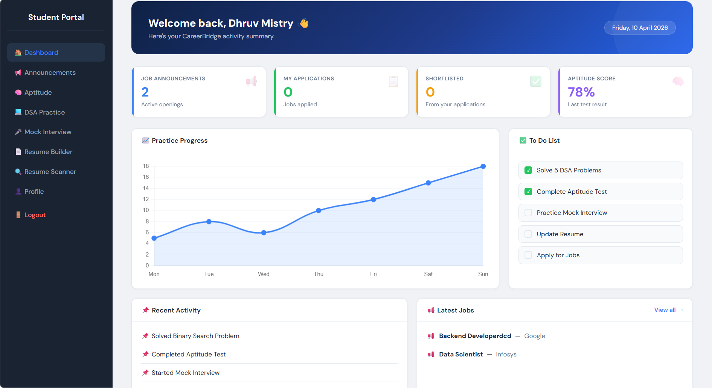
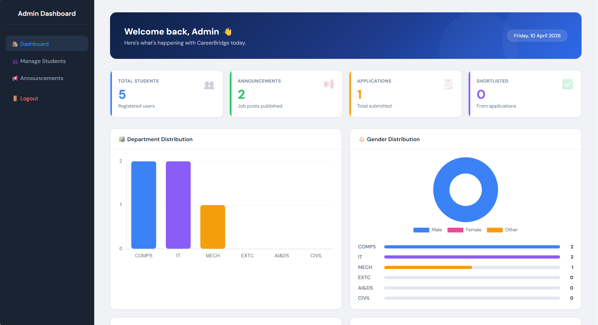
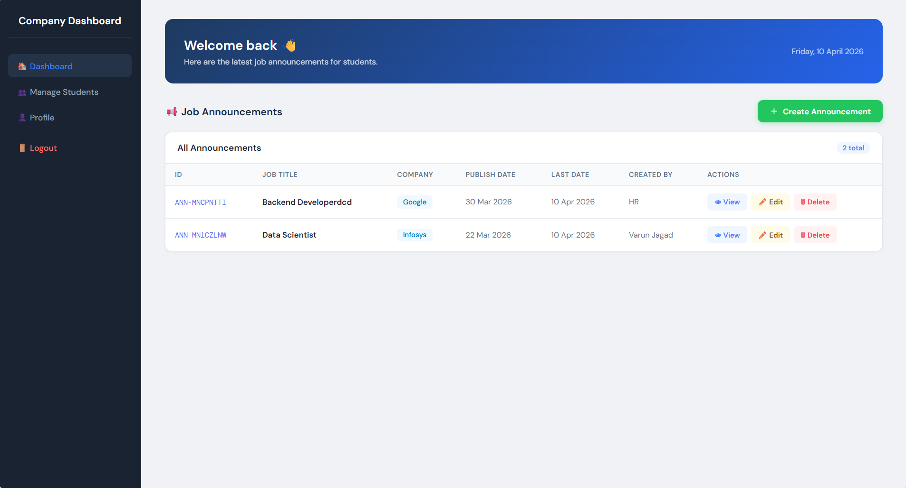

# CareerBridge AI 🎓
### An AI-Driven Training & Placement Management System


## 📌 Overview
CareerBridge AI is a full-stack AI-based placement system with features like student login, recruiter dashboard, resume analysis, job matching, and real-time communication. It uses Groq API for AI functionalities and MongoDB for managing user data, job postings, and applications efficiently.

---

## 🖥️ Screenshots

### Student Dashboard


### Admin Dashboard


### Company Dashboard



---

## 🚀 Features
- ✅ Student Login & Dashboard
- ✅ Company/Recruiter Dashboard
- ✅ Admin Panel
- ✅ AI-based Resume Analysis
- ✅ Job Matching System
- ✅ Resume Builder
- ✅ Real-time Communication

---

## 🛠️ Tech Stack
- **Frontend:** HTML, CSS, JavaScript, Bootstrap
- **Backend:** Node.js, Express.js
- **Database:** MongoDB
- **AI:** Groq API

---

## ⚙️ How to Run

### 1. Clone the repository
```bash
git clone https://github.com/Varunjagad21/CareerBridge-AI--An-AI-Driven-Training-Placement-Management-System.git
```

### 2. Install dependencies
```bash
cd backend
npm install
```

### 3. Start the server
```bash
npm start
```

### 4. Open in browser
http://localhost:5000

## 👨‍💻 Developer
**Varun Jagad**